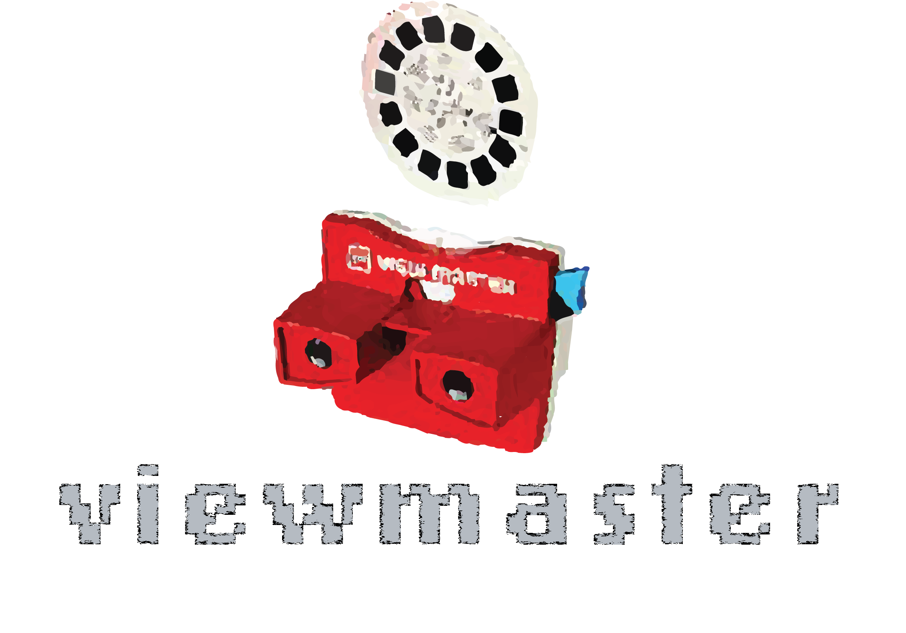

</a>

Viewmaster is a method for performing unsupervised classification of single cells across datasets written for use in the R environment.

**Visit [wiki page](https://github.com/waltno/viewmaster/wiki/Home) for installation instructions and tutorials**

## Acknowledgements

Written by Scott Furlan.

</a>

